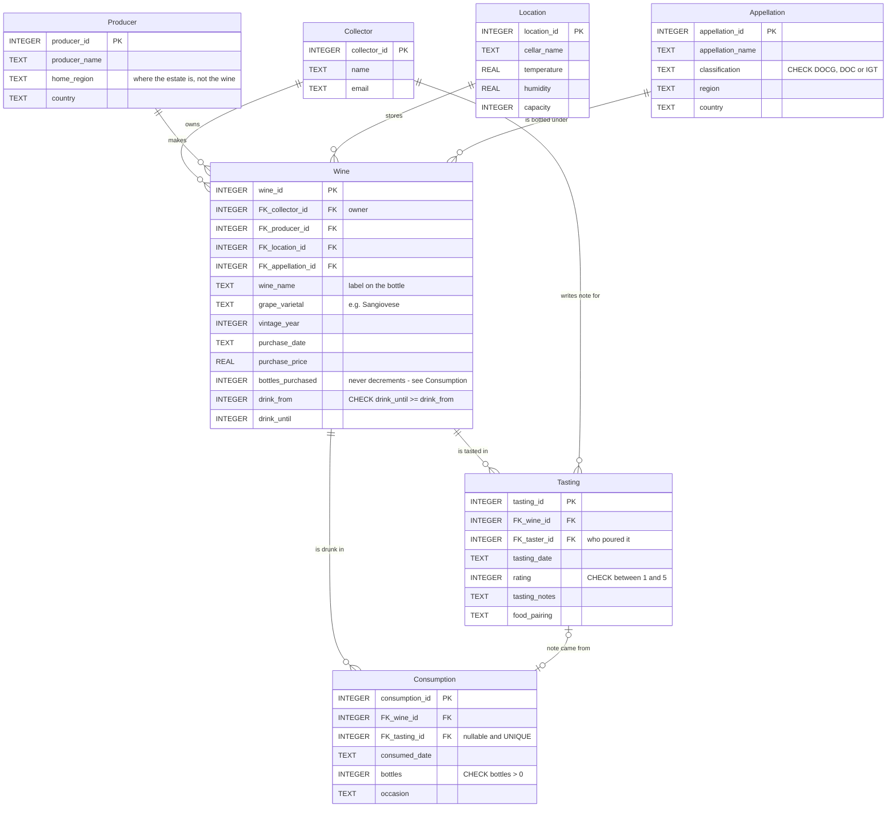

# Wine Cellar Management System

[](https://github.com/liciazheng/wine-cellar-management-system/actions/workflows/ci.yml)

A relational database for tracking a private wine collection — what is in the cellar, where it is stored, what it cost, and how each bottle tasted over time.

SQLite, no dependencies. Clone it and open the `.db`.

> **The data in this repository is entirely made up.** It is a demo dataset written to exercise the schema, not a record of a real collection. See [About the data](#about-the-data).

## Why

Most collectors track their bottles on paper or in a spreadsheet, which stops scaling once the collection grows past a couple of shelves. Purchase details, storage conditions, and tasting notes end up in three different places, and nothing links them.

I grew up around people who collect wine and got curious about the difference between Italian and American palates, which is what got me into the data side of it. This schema puts everything in one place so a collector can answer the questions that actually come up: which bottle is closing its drinking window, which cellar is running out of room, and what the collection is worth.

## Schema

Seven tables, third normal form:

| Table | Rows | Description |
|---|---|---|
| `Collector` | 4 | Collection owners, who are also the tasters |
| `Producer` | 6 | Wineries, with the region the estate is based in |
| `Appellation` | 9 | Denominations — name, classification, region, country |
| `Location` | 4 | Storage areas, with temperature, humidity, capacity |
| `Wine` | 15 | Labels — name, grape, vintage, price, bottles bought, drinking window |
| `Tasting` | 18 | Dated tasting events — taster, 1–5 rating, notes, food pairing |
| `Consumption` | 27 | Bottles leaving the cellar, optionally tied to the note they produced |



`Collector` reaches `Tasting` twice over: once as the owner of the bottle (through `Wine`) and once as the author of the note (directly). Q7 is the query that uses both at the same time.

`Wine` is the central table, carrying four foreign keys. `Tasting` is many-to-one against `Wine`, so a bottle can be tasted repeatedly and its evolution tracked — wine 1 has three tastings across two years, climbing from 4 to 5 as it opened up.

The modelling decisions worth calling out:

**Name, grape and appellation are separate things.** Collapsing them into one field is a common shortcut that quietly breaks querying. *Chianti Classico* is an appellation made from Sangiovese; *Solaia* is a proprietary name for a Cabernet bottled as Toscana IGT; *Nebbiolo* is a grape. With one column you cannot ask "how much Sangiovese do I own?" — separated, it's a `GROUP BY`.

**The appellation is its own table, because it carries facts of its own.** It started as free text on `Wine`, which repeated `'Chianti Classico DOCG'` on every bottle and buried a transitive dependency: an appellation determines its region and its classification, so those belong with the appellation rather than with each bottle. Two consequences:

- **Classification is queryable.** `DOCG` / `DOC` / `IGT` used to be a suffix inside a text string, so "what share of the cellar is DOCG" meant pattern-matching. It is now a column with a `CHECK` on the three legal values.
- **Region no longer comes from the producer.** `Q1` used to report `Producer.region` in a position that read as the wine's region, and grouping by region meant grouping by *where the winery is*. Antinori is a Tuscan house that bottles Chianti Classico in Chianti and Solaia in Bolgheri — same region here, but the schema was encoding an assumption that does not hold in general. `Producer.home_region` now says what it means, and a wine's region comes from its appellation. In this sample data every estate happens to bottle within its home region, so the numbers do not move; what changed is that they are no longer derived from the wrong column.

Ageing designations stay in `wine_name`. A *Chianti Classico Riserva* is a Chianti Classico DOCG that was aged longer, so treating `Riserva` as its own appellation would split one region's holdings across two rows meaning the same place.

**The drinking window is two integers, not a string.** `drink_from` / `drink_until` instead of `'2023-2028'`, so the project's motivating question is a `BETWEEN` rather than string parsing. A `CHECK (drink_until >= drink_from)` keeps the pair coherent, and ratings are constrained with `CHECK (rating >= 1 AND rating <= 5)`.

**`Tasting` records who tasted, not just what.** `FK_taster_id` points back to `Collector`, so a note has an author. Bottles get opened by people other than their owner, and without this the "share tasting experiences" case has nowhere to live — 6 of the 18 tastings in the sample data are on someone else's bottle.

**Stock is derived, not stored.** `bottles_purchased` never changes; what is left is that minus everything in `Consumption`. An earlier version of this schema had a single `quantity` column that stayed put while bottles were being tasted, so the number silently meant "bought" while reading like "in stock" — a cellar that never empties. Of 62 bottles bought, 27 have been drunk and 35 are on the racks.

`Consumption` carries a nullable, `UNIQUE` `FK_tasting_id`. SQLite allows many NULLs in a unique column, which is exactly the behaviour wanted: any number of bottles can be opened without a note, but no single note can be claimed by two openings. It deliberately has no collector column — whose cellar the bottle left is a fact about the `Wine`, and who drank it is a fact about the `Tasting`, so storing either here would just duplicate them.

**You cannot drink more than you bought, and the database enforces it.** That rule spans rows and tables, so a `CHECK` cannot express it:

```sql
CREATE TRIGGER trg_consumption_insert_within_stock
BEFORE INSERT ON Consumption
BEGIN
    SELECT RAISE(ABORT, 'consumption would exceed bottles purchased')
    WHERE NEW.bottles + (
              SELECT COALESCE(SUM(bottles), 0) FROM Consumption
              WHERE FK_wine_id = NEW.FK_wine_id
          ) > (
              SELECT bottles_purchased FROM Wine WHERE wine_id = NEW.FK_wine_id
          );
END;
```

A companion trigger covers `UPDATE`, excluding the row being edited from the running total — otherwise raising one row by a bottle would count itself twice and be refused.

Foreign keys, the drinking window and `Consumption.FK_wine_id` are indexed.

**Remaining stock is a view, not a repeated subquery.** Almost every question worth asking needs it, and spelling it out inline meant retyping the same correlated subquery in each one. `WineStock` does it once, with a `LEFT JOIN` onto a single aggregate over `Consumption` — so the sum runs once per wine rather than once per row of the outer query, and a wine nobody has opened still appears with its full stock. `CellarOccupancy` rolls that up per location. Both are in [`sql/01_schema.sql`](sql/01_schema.sql).

## Queries

[`sql/03_queries.sql`](sql/03_queries.sql) holds twelve queries:

| | Query | Demonstrates |
|---|---|---|
| Q1 | Full collection inventory | 3-table join through the stock view |
| Q2 | **What should I drink this year?** | `BETWEEN` on the window, `CASE` urgency bucket, 4-table join |
| Q3 | Wine ranking by average score | `GROUP BY` + `HAVING` |
| Q4 | Holdings by grape varietal | aggregation over the split-out varietal column |
| Q5 | Cellar utilisation | straight from `CellarOccupancy` |
| Q6 | Highly rated tastings, with author | two joins to `Collector` from one row |
| Q7 | Notes on someone else's bottle | self-referencing filter on the same two joins |
| Q8 | Collector portfolio: bought, drunk, held | derived totals on both stock columns |
| Q9 | **Drink-down rate and projected run-out** | `julianday` date arithmetic, nested `CASE` verdict |
| Q10 | The drinking log by year | `strftime` grouping, `COUNT` over a nullable FK |
| Q11 | Wines that are gone — restock? | finished stock joined to how it rated |
| Q12 | **Holdings by region and classification** | the query the old schema could not answer |

### Q2 — what should I drink this year

Reads the current year from `strftime('%Y', 'now')`, so it stays correct without editing. Run in 2026 it returns 12 wines, with bottles counted as what is left rather than what was bought:

| Wine | Vintage | Producer | Bottles left | Drink until | Years left | Urgency |
|---|---|---|---|---|---|---|
| Chianti Classico | 2017 | Fontodi | 1 | 2027 | 1 | **drink now** |
| Chianti Classico | 2018 | Antinori | 1 | 2028 | 2 | drink soon |
| Valpolicella Superiore | 2020 | Allegrini | 3 | 2028 | 2 | drink soon |
| Chianti Classico Riserva | 2019 | Fontodi | 5 | 2029 | 3 | drink soon |
| Bolgheri Rosso | 2020 | Tenuta San Guido | 4 | 2030 | 4 | holding well |
| … | | | | | | |
| Barolo Riserva | 2015 | Marchesi di Barolo | 1 | 2040 | 14 | holding well |

Three wines are absent, for two different reasons. A 2019 Bolgheri Superiore (2029–2039) and a 2020 Brunello (2028–2038) are not yet open. **Solaia is in its window but gone** — both bottles were drunk, the second one without a note. Before consumption tracking existed this query recommended it anyway, which is the kind of wrong answer a schema can produce while every individual value in it is correct.

### Q4 — holdings by grape

Bottles bought, since this one is about what the collection is made of:

| Grape | Labels | Bottles bought | Total spend | Appellations |
|---|---|---|---|---|
| Sangiovese | 5 | 26 | $1,748.00 | 3 |
| Nebbiolo | 5 | 15 | $1,901.00 | 3 |
| Corvina | 2 | 12 | $762.00 | 2 |
| Cabernet Sauvignon | 3 | 9 | $1,235.00 | 2 |

### Q8 — collector portfolios

| Collector | Unique wines | Bottles bought | Total investment |
|---|---|---|---|
| Michael Brown | 4 | 15 | $1,732.00 |
| Sarah Davis | 3 | 16 | $1,400.00 |
| John Smith | 4 | 14 | $1,257.00 |
| Emily Johnson | 4 | 17 | $1,257.00 |

### Q5 — cellar utilisation

Bottles on hand, since this one is about how full the racks are. Both columns are shown because the gap between them is the point:

| Cellar | Bought | On hand | Capacity | Used |
|---|---|---|---|---|
| Wine Refrigerator | 11 | 6 | 50 | 12.0% |
| Guest House Cellar | 16 | 12 | 100 | 12.0% |
| Basement Storage | 17 | 8 | 200 | 4.0% |
| Main Cellar | 18 | 9 | 500 | 1.8% |

### Q9 — am I drinking these fast enough?

The most useful thing the consumption table makes possible. Rate is bottles drunk per year since purchase; projecting the remaining stock forward at that rate gives a run-out year, which is then compared against the drinking window:

| Wine | Left | Bottles/year | Runs out | Window closes | Verdict |
|---|---|---|---|---|---|
| Valpolicella Superiore | 3 | 0.90 | 2029 | 2028 | **drinking too slowly** |
| Chianti Classico (Antinori) | 1 | 0.77 | 2027 | 2028 | on track |
| Chianti Classico Riserva | 5 | 0.73 | 2033 | 2029 | **drinking too slowly** |
| Amarone della Valpolicella | 4 | 0.72 | 2032 | 2036 | on track |
| Bolgheri Rosso | 4 | 0.33 | 2038 | 2030 | **drinking too slowly** |
| Barbaresco (Gaja, 2018) | 3 | 0.28 | 2037 | 2033 | **drinking too slowly** |
| … | | | | | |

Seven of the thirteen wines with a drinking rate will still be sitting in the cellar after their window shuts. Bolgheri Rosso is the worst: at the current pace the last bottle gets opened around 2038, eight years past its best. The opposite failure also shows up — Solaia was drunk to zero in 2025 with its window running to 2041.

Wines with no rate get no verdict: one has never been opened, and a finished wine has nothing left to project.

### Q10 — the drinking log

| Year | Bottles opened | With a note | Without | Average rating |
|---|---|---|---|---|
| 2023 | 6 | 6 | 0 | 4.33 |
| 2024 | 14 | 12 | 2 | 4.33 |
| 2025 | 7 | 0 | 7 | — |

The note-taking stopped in 2025 while the drinking did not. That gap is the whole reason `FK_tasting_id` is nullable — a schema that required a note per bottle could not record this year at all.

### Q12 — holdings by region and classification

Neither axis of this table existed before the `Appellation` table. Region was read off the producer, and the classification was a suffix inside a text string:

| Region | Class | Labels | Producers | Bought | On hand | Value on hand |
|---|---|---|---|---|---|---|
| Piedmont | DOCG | 4 | 2 | 12 | 9 | $1,269.00 |
| Tuscany | DOCG | 4 | 2 | 23 | 10 | $670.50 |
| Tuscany | DOC | 2 | 1 | 7 | 5 | $480.00 |
| Veneto | DOCG | 1 | 1 | 6 | 4 | $340.00 |
| Tuscany | IGT | 2 | 1 | 5 | 2 | $220.00 |
| Piedmont | DOC | 1 | 1 | 3 | 2 | $176.00 |
| Veneto | DOC | 1 | 1 | 6 | 3 | $126.00 |

Tuscany dominates by bottles bought — 35 of 62 across its three classifications — but Piedmont holds the most value still on the racks. The Barolo and Barbaresco have long windows and have barely been touched, while the Tuscan Chianti has been the everyday drinking. `DOCG` accounts for 41 of the 62 bottles.

## Layout

```
sql/
  01_schema.sql      tables, keys, constraints, triggers, indexes, views
  02_seed_data.sql   sample data
  03_queries.sql     the twelve queries
database/
  wine_collection.db ready-to-open SQLite database, built from the scripts above
tests/
  test_database.py   54 tests over the schema, constraints, triggers, views and queries
```

## Running it

Open `database/wine_collection.db` in [DB Browser for SQLite](https://sqlitebrowser.org/) and run anything from `sql/03_queries.sql`.

Or build it from scratch:

```bash
sqlite3 wine_collection.db < sql/01_schema.sql
sqlite3 wine_collection.db < sql/02_seed_data.sql
sqlite3 wine_collection.db < sql/03_queries.sql
```

## Tests

```bash
pip install pytest
pytest
```

23 tests, and they check more than "does it run":

- The SQL scripts build the schema they claim, and the **committed `.db` has not drifted** from them — same columns, same types, same row counts.
- **Every constraint actually rejects bad data.** A rating of 0 or 6, a `drink_until` earlier than `drink_from`, a wine with no name, a wine owned by a nonexistent collector, a tasting by a nonexistent taster — each is asserted to raise `IntegrityError` rather than being silently stored.
- All eight queries execute and return rows.
- Q2 is checked both ways: every bottle it returns is inside its drinking window, and every bottle it excludes really is closed or not yet open.
- The design intents hold in the data — shared tastings exist, and at least one wine has three dated tastings so the evolution case is real.
- The bug this schema was fixed to avoid stays fixed: no appellation word (`DOCG`, `Riserva`, `Classico` …) has leaked back into `grape_varietal`.
- No cellar is over capacity, no drinking window starts before its vintage, and every collector email is on the reserved `example.com` domain.

## About the data

**Every row is invented.** There is no real collection behind this repository.

- The **collectors** are fictional people. Their addresses use the reserved `example.com` domain and reach nobody.
- The **bottles, purchase prices, purchase dates, quantities and drinking windows** are all fabricated. The prices are in a plausible range for the appellations named, but no bottle here was bought, and none of the windows reflects a real assessment.
- The **ratings, tasting notes and food pairings** are written to look like tasting notes. Nobody tasted these wines. They are not opinions about any real wine.
- The **producer names, grape varieties, appellations and their classifications** are real — they are reference data, the same way a country list is, and they are there so the joins operate on values that behave like the real thing.

The dataset is sized to demonstrate the schema and the queries, not to be analysed: 15 wines, 18 tastings and 27 opened bottles will not support any conclusion about wine.
