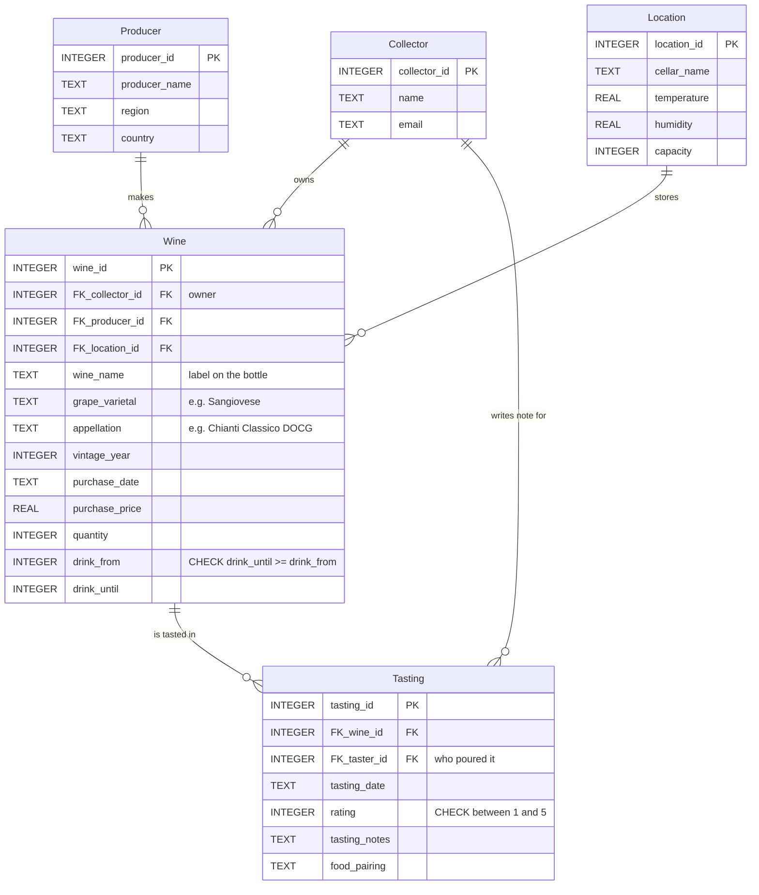

# Wine Cellar Management System

A relational database for tracking a private wine collection — what is in the cellar, where it is stored, what it cost, and how each bottle tasted over time.

SQLite, no dependencies. Clone it and open the `.db`.

> **The data in this repository is entirely made up.** It is a demo dataset written to exercise the schema, not a record of a real collection. See [About the data](#about-the-data).

## Why

Most collectors track their bottles on paper or in a spreadsheet, which stops scaling once the collection grows past a couple of shelves. Purchase details, storage conditions, and tasting notes end up in three different places, and nothing links them.

I grew up around people who collect wine and got curious about the difference between Italian and American palates, which is what got me into the data side of it. This schema puts everything in one place so a collector can answer the questions that actually come up: which bottle is closing its drinking window, which cellar is running out of room, and what the collection is worth.

## Schema

Five tables, third normal form:

| Table | Rows | Description |
|---|---|---|
| `Collector` | 4 | Collection owners, who are also the tasters |
| `Producer` | 6 | Wineries, with region and country |
| `Location` | 4 | Storage areas, with temperature, humidity, capacity |
| `Wine` | 15 | Bottles — name, grape, appellation, vintage, price, quantity, drinking window |
| `Tasting` | 18 | Dated tasting events — taster, 1–5 rating, notes, food pairing |



`Collector` reaches `Tasting` twice over: once as the owner of the bottle (through `Wine`) and once as the author of the note (directly). Q7 is the query that uses both at the same time.

`Wine` is the central table, carrying three foreign keys. `Tasting` is many-to-one against `Wine`, so a bottle can be tasted repeatedly and its evolution tracked — wine 1 has three tastings across two years, climbing from 4 to 5 as it opened up.

Three modelling decisions worth calling out:

**Name, grape and appellation are separate columns.** They vary independently, and collapsing them into one field is a common shortcut that quietly breaks querying. *Chianti Classico* is an appellation made from Sangiovese; *Solaia* is a proprietary name for a Cabernet bottled as Toscana IGT; *Nebbiolo* is a grape. With one column you cannot ask "how much Sangiovese do I own?" — with three, it's a `GROUP BY`.

**The drinking window is two integers, not a string.** `drink_from` / `drink_until` instead of `'2023-2028'`, so the project's motivating question is a `BETWEEN` rather than string parsing. A `CHECK (drink_until >= drink_from)` keeps the pair coherent, and ratings are constrained with `CHECK (rating >= 1 AND rating <= 5)`.

**`Tasting` records who tasted, not just what.** `FK_taster_id` points back to `Collector`, so a note has an author. Bottles get opened by people other than their owner, and without this the "share tasting experiences" case has nowhere to live — 6 of the 18 tastings in the sample data are on someone else's bottle.

Foreign keys and the drinking window are indexed.

## Queries

[`sql/03_queries.sql`](sql/03_queries.sql) holds eight queries:

| | Query | Demonstrates |
|---|---|---|
| Q1 | Full collection inventory | 3-table join |
| Q2 | **What should I drink this year?** | `BETWEEN` on the window, `CASE` urgency bucket, 4-table join |
| Q3 | Wine ranking by average score | `GROUP BY` + `HAVING` |
| Q4 | Holdings by grape varietal | aggregation over the split-out varietal column |
| Q5 | Cellar utilisation | aggregate arithmetic against capacity |
| Q6 | Highly rated tastings, with author | two joins to `Collector` from one row |
| Q7 | Notes on someone else's bottle | self-referencing filter on the same two joins |
| Q8 | Collector portfolio value | `COUNT DISTINCT`, `ROUND`, derived totals |

### Q2 — what should I drink this year

Reads the current year from `strftime('%Y', 'now')`, so it stays correct without editing. Run in 2026, 13 of the 15 wines are inside their window:

| Wine | Vintage | Producer | Bottles | Drink until | Years left | Urgency |
|---|---|---|---|---|---|---|
| Chianti Classico | 2017 | Fontodi | 5 | 2027 | 1 | **drink now** |
| Chianti Classico | 2018 | Antinori | 6 | 2028 | 2 | drink soon |
| Valpolicella Superiore | 2020 | Allegrini | 6 | 2028 | 2 | drink soon |
| Chianti Classico Riserva | 2019 | Fontodi | 8 | 2029 | 3 | drink soon |
| Bolgheri Rosso | 2020 | Sassicaia | 5 | 2030 | 4 | holding well |
| … | | | | | | |
| Solaia | 2016 | Antinori | 2 | 2041 | 15 | holding well |

The two absent bottles — a 2019 Bolgheri Superiore (2029–2039) and a 2020 Brunello (2028–2038) — are correctly excluded as not yet open.

### Q4 — holdings by grape

| Grape | Labels | Bottles | Total value | Appellations |
|---|---|---|---|---|
| Sangiovese | 5 | 26 | $1,748.00 | 3 |
| Nebbiolo | 5 | 15 | $1,901.00 | 3 |
| Corvina | 2 | 12 | $762.00 | 2 |
| Cabernet Sauvignon | 3 | 9 | $1,235.00 | 2 |

### Q8 — collector portfolios

| Collector | Unique wines | Bottles | Total investment |
|---|---|---|---|
| Michael Brown | 4 | 15 | $1,732.00 |
| Sarah Davis | 3 | 16 | $1,400.00 |
| John Smith | 4 | 14 | $1,257.00 |
| Emily Johnson | 4 | 17 | $1,257.00 |

### Q5 — cellar utilisation

| Cellar | Bottles | Capacity | Used |
|---|---|---|---|
| Wine Refrigerator | 11 | 50 | 22.0% |
| Guest House Cellar | 16 | 100 | 16.0% |
| Basement Storage | 17 | 200 | 8.5% |
| Main Cellar | 18 | 500 | 3.6% |

## Layout

```
sql/
  01_schema.sql      tables, keys, constraints, indexes
  02_seed_data.sql   sample data
  03_queries.sql     the eight queries
database/
  wine_collection.db ready-to-open SQLite database, built from the scripts above
```

## Running it

Open `database/wine_collection.db` in [DB Browser for SQLite](https://sqlitebrowser.org/) and run anything from `sql/03_queries.sql`.

Or build it from scratch:

```bash
sqlite3 wine_collection.db < sql/01_schema.sql
sqlite3 wine_collection.db < sql/02_seed_data.sql
sqlite3 wine_collection.db < sql/03_queries.sql
```

## About the data

**Every row is invented.** There is no real collection behind this repository.

- The **collectors** are fictional people. Their addresses use the reserved `example.com` domain and reach nobody.
- The **bottles, purchase prices, purchase dates, quantities and drinking windows** are all fabricated. The prices are in a plausible range for the appellations named, but no bottle here was bought, and none of the windows reflects a real assessment.
- The **ratings, tasting notes and food pairings** are written to look like tasting notes. Nobody tasted these wines. They are not opinions about any real wine.
- The **producer names, grape varieties and appellations** are real — they are reference data, the same way a country list is, and they are there so the joins operate on values that behave like the real thing.

The dataset is sized to demonstrate the schema and the queries, not to be analysed: 15 wines and 18 tastings will not support any conclusion about wine.
